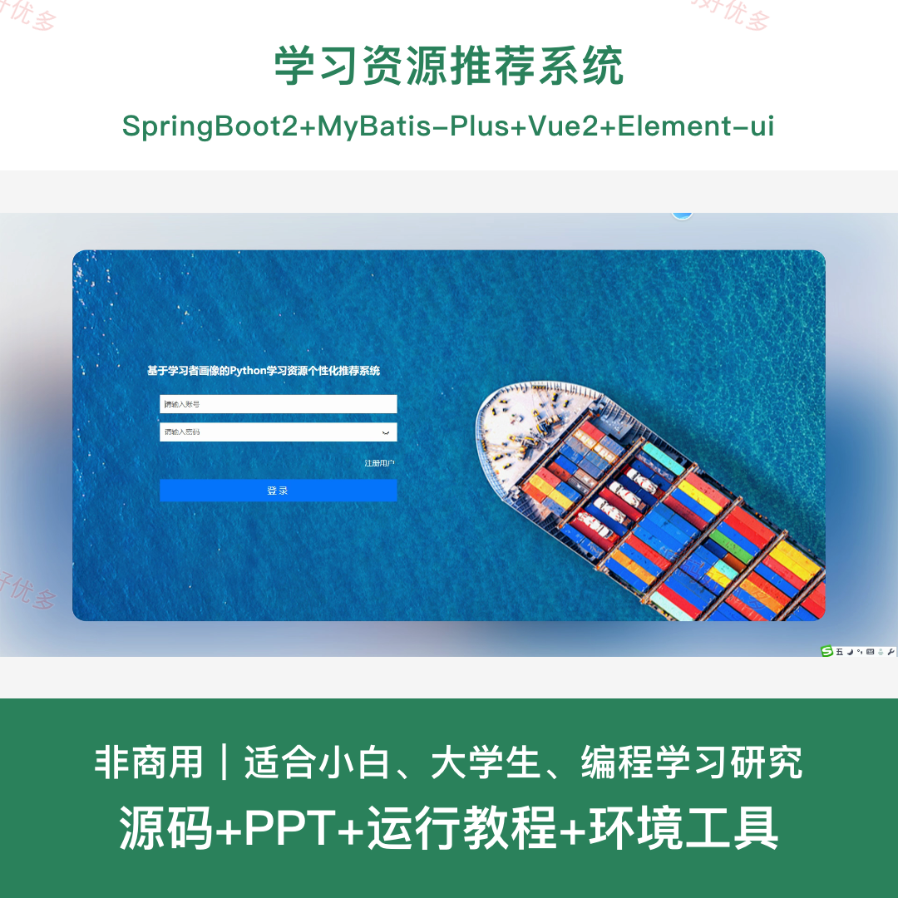
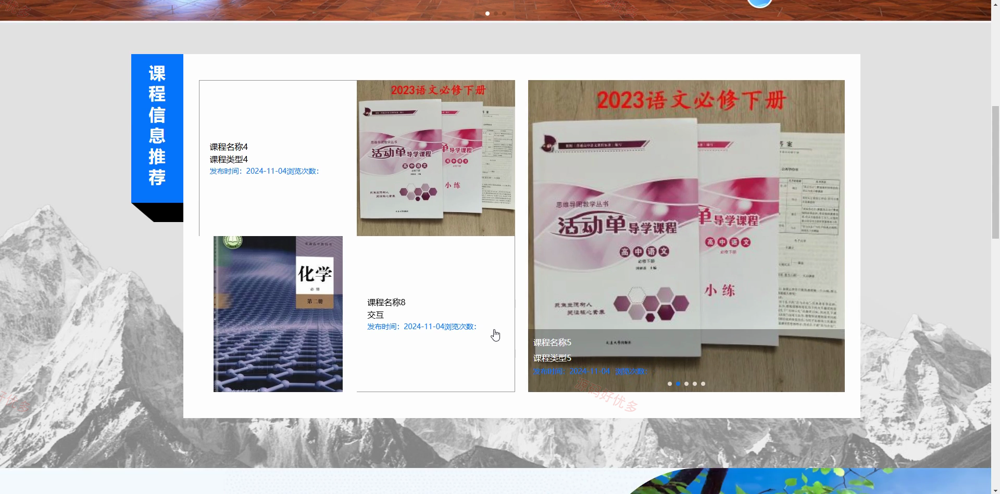
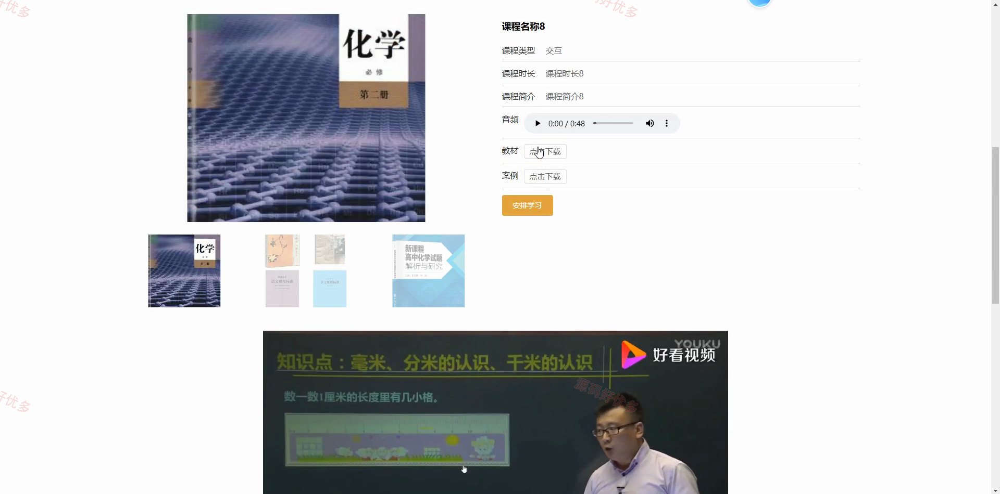
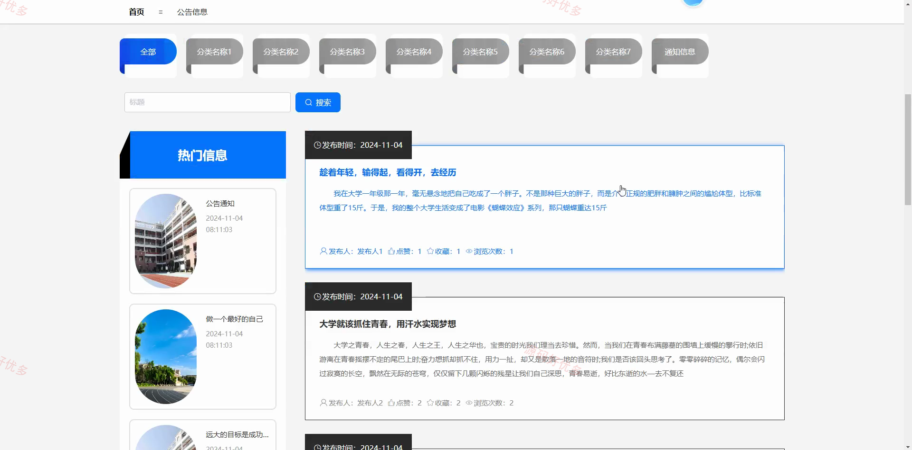
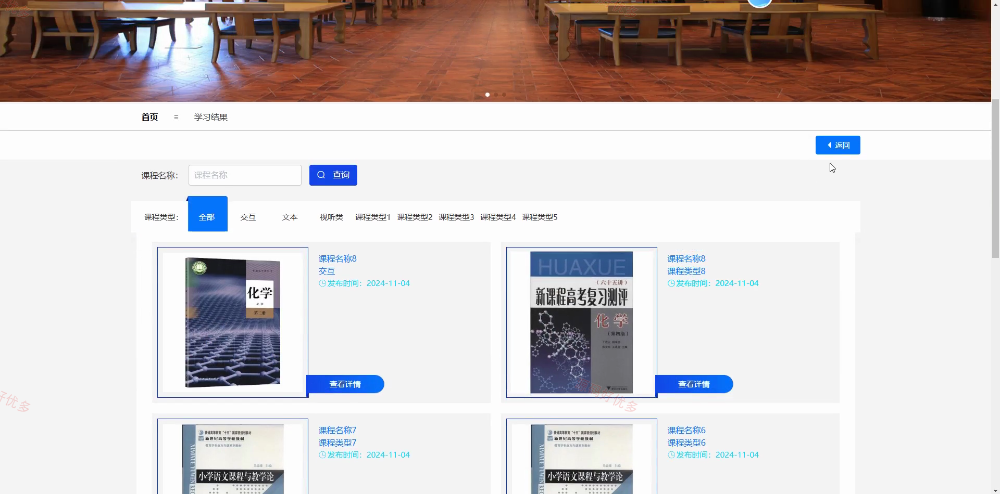
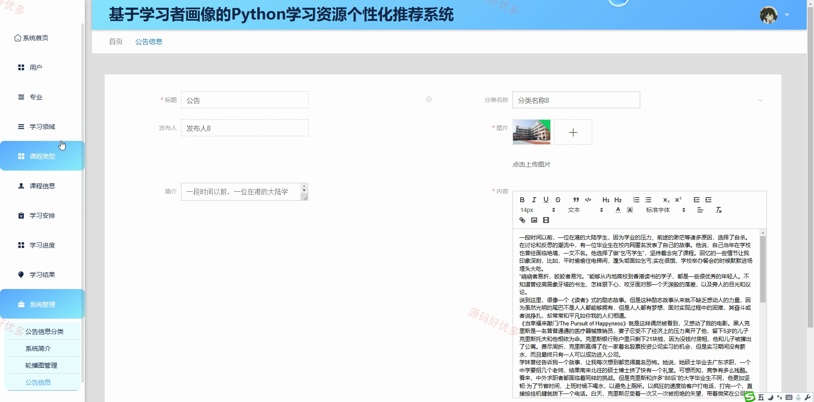
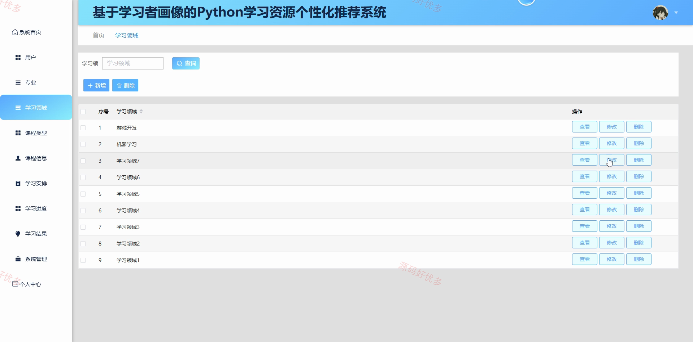
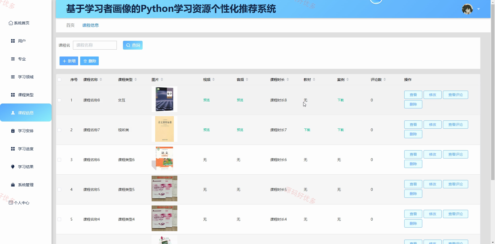

# python134D
python134D学习资源推荐系统
## 源码问题查看主页咨询

### 一、关键词
学习资源推荐系统、学习资源推荐、学习资源推荐信息管理、学习资源推荐后台管理

### 二、作品包含
源码+数据库+PPT+全套环境和工具资源+本地部署教程

### 三、项目技术
前端技术： Html、Css、Js、Vue2.6、Element-ui
后端技术：Java、SpringBoot2.2.2、MyBatis-Plus

### 四、运行环境（以下版本亲测，其他版本兼容性请自行测试）
开发工具：IDEA/eclipse + VSCODE

数据库：MySQL5.7+（共16张表）

数据库管理工具：Navicat10以上版本

环境配置软件： JDK1.8 + Maven3.6.3

前端Nodejs：14+

浏览器：谷歌浏览器

### 五、项目介绍
项目编号：python134D

学习资源推荐系统围绕 Python 课程资源与学习过程管理，为用户提供课程浏览、资料下载、学习安排、进度跟踪和结果查看，为管理员提供课程分类、学习数据与系统公告管理。

角色：管理员、用户

管理员功能：用户与专业信息管理、学习领域与课程类型管理、Python课程信息与评论管理、学习安排管理、学习进度管理、学习结果与时长统计、学习数据看板查看、系统公告及基础配置管理。

用户功能：注册登录与个人信息维护、Python课程浏览与检索、课程资料预览与下载、课程评论与互动、课程学习安排、开始学习并跟踪进度、结束学习并生成结果、学习结果查看与资料下载。

### 六、运行截图

